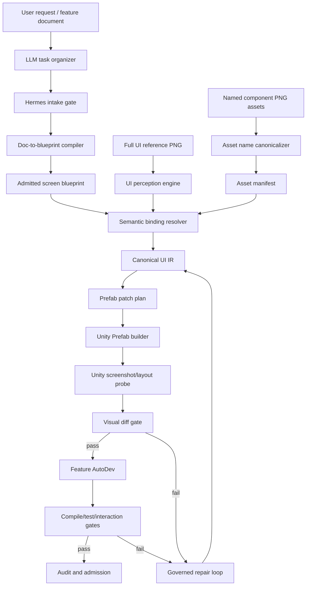

# Hermes Unity UI AutoDev Skill

## Project Status

This repository is the project-level architecture document for `Hermes Unity UI AutoDev Skill`.

Current status: `architecture-design / pre-live-implementation`.

This document does not claim that `aegisfabric pipeline v1.2` is already repaired, stable, or live-ready. The intended sequence is:

```text
repair current v1.2
-> sync repaired behavior back into the v1.2 blueprint
-> generate a fresh v1.2 live version
-> use v1.2 live as the governed skill factory
-> derive Hermes Unity UI AutoDev Skill as a child skill
```

## One-Line Definition

`Hermes Unity UI AutoDev Skill` turns a game UI reference image, UI asset library, and feature document or blueprint into a governed Unity Prefab, generated feature-binding code, validation evidence, audit records, and repair/admission verdicts.

## Core Positioning

This skill is not a loose LLM prompt and not a direct "PNG to Prefab" script.

It is a governed execution skill:

```text
LLM = task driver / intent organizer
Hermes Unity UI AutoDev Skill = governed executor
Unity project = mutation target
governance kernel = admission authority
```

The LLM may organize the task, explain ambiguity, and prepare candidate intent. It must not directly mutate Unity files, rename assets, generate final Prefabs, repair source files, or admit completion. Those actions belong to the Hermes skill execution flow.

## Main Problems Solved

1. Convert non-standard feature documents into admitted UI feature blueprints.
2. Normalize imperfect UI asset names such as `icon_*`, `button_*`, `panel_*`, and `bg_*`.
3. Reconstruct a Unity UI Prefab from a full-screen reference PNG and prepared component PNG assets.
4. Determine which UI component carries which blueprint function.
5. Generate Unity UI hierarchy, RectTransform layout, component bindings, Controller/ViewModel stubs, and event hookups.
6. Validate visual reconstruction by screenshot comparison against the reference image.
7. Validate runtime behavior through Unity compilation, EditMode/PlayMode tests, interaction probes, and Console error scans.
8. Preserve audit trails for low-confidence matches, manual overrides, delta patches, repair loops, and final admission.

## Architecture Summary



## Main Workflow

```text
1. Intake
   Feature document or blueprint, full-screen UI PNG, component PNG folder,
   naming rules, Unity project path, target screen id.

2. Blueprint preparation
   If the input is a standard blueprint, validate it.
   If the input is a planning document, compile it into a candidate blueprint,
   run governance checks, and admit only the validated version.

3. Asset governance
   Parse component asset names, infer category and role hints, generate
   asset-manifest.json, and record ambiguous assets.

4. UI perception
   Detect visual nodes, bounding boxes, text, hierarchy candidates, visual type
   candidates, and layer ordering from the full reference PNG.

5. Semantic binding
   Match visual nodes and assets to blueprint function nodes by multi-signal
   scoring: filename tokens, OCR text, visual role, position, nearby context,
   screen scope, and declared blueprint function.

6. Canonical UI IR
   Emit the governed intermediate representation that joins visual, asset,
   semantic, layout, state, and Unity projection truth.

7. UI reconstruction
   Generate or patch Unity Canvas/Prefab through Unity Editor scripts,
   not direct uncontrolled YAML edits.

8. Visual validation
   Capture Unity screenshots, export RectTransform probes, compare against
   the reference PNG, and route failures to repair.

9. Feature AutoDev
   Generate Controller/ViewModel/event binding stubs, state transitions,
   data-binding placeholders, and interaction tests from the admitted blueprint.

10. Runtime validation
    Run Unity compile, EditMode/PlayMode tests, interaction simulation, and
    Console error scanning.

11. Audit and admission
    Emit evidence packs, ambiguity ledgers, manual override ledgers, patch
    plans, visual diffs, test logs, and final pass/blocked/waived verdict.
```

## Required Authority Boundary

The skill must preserve four truth layers:

| Layer | Authority |
| --- | --- |
| Full UI reference PNG | Visual truth |
| Component asset library | Asset truth |
| Feature blueprint or admitted document-derived blueprint | Functional and semantic truth |
| Unity Prefab and generated C# | Governed projection, valid only after verification |

## Required Documentation

The full architecture and workflow specification is in:

- [docs/architecture-and-workflow.md](docs/architecture-and-workflow.md)

## Initial Deliverable

This repository currently defines the target architecture before the `v1.2 live` derivation step. Implementation should begin only after current `v1.2` is repaired, synchronized back to blueprint authority, and regenerated into a verified `v1.2 live` executor.
