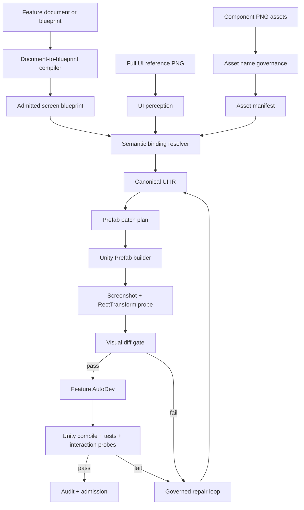

# Hermes Unity UI AutoDev Skill

`Hermes Unity UI AutoDev Skill` is a governed Unity UI automation skill for turning game UI references, component assets, and feature intent into verified Unity Prefabs, feature-binding code, validation evidence, and audit records.

Current status: `architecture-design / pre-live-implementation`

This repository defines the target child-skill architecture. It does not claim that `aegisfabric pipeline v1.2` is already repaired, stable, or live-ready.

## Why This Exists

Game UI implementation often breaks down at the handoff between design, planning, and Unity:

| Problem | Hermes Answer |
| --- | --- |
| A full-screen UI image shows the target look but not the component semantics. | Build a Canonical UI IR that joins visual nodes, assets, layout, and blueprint function meaning. |
| UI assets are named loosely, for example `icon_*`, `button_*`, `panel_*`. | Normalize names into an audited asset manifest before reconstruction. |
| Planning gives a feature document instead of a strict blueprint. | Compile the document into a candidate blueprint, then admit it through governance gates. |
| LLMs can write files directly and bypass process. | Keep the LLM as task organizer; Hermes is the governed executor and admission authority. |
| A generated Prefab can look close but still be wrong. | Capture Unity screenshots, RectTransform probes, visual diffs, tests, and audit evidence. |

## Core Principle

```text
LLM = task driver / intent organizer
Hermes Unity UI AutoDev Skill = governed executor
Unity project = mutation target
governance kernel = admission authority
```

The LLM may summarize requirements, prepare task packets, and explain evidence. It must not directly mutate Unity files, rename assets, generate final Prefabs, repair code, or admit completion. Those actions must pass through the Hermes skill workflow.

## v1.2 Derivation Sequence

This skill is intended to be derived after the Hermes mother skill is repaired and regenerated:

```text
repair current aegisfabric pipeline v1.2
-> sync repaired behavior back into the v1.2 blueprint
-> generate a fresh v1.2 live executor
-> use v1.2 live as the governed skill factory
-> derive Hermes Unity UI AutoDev Skill as a Unity child skill
```

`v1.2 live` should remain a generic governed executor and skill factory. `Hermes Unity UI AutoDev Skill` is the Unity-specific child skill.

## Capability Map

| Capability | What It Does | Main Output | Gate |
| --- | --- | --- | --- |
| Document-to-Blueprint | Converts planning docs into candidate screen blueprints. | `admitted-screen-blueprint.json` | blueprint admission gate |
| Asset Name Governance | Normalizes imperfect UI asset names into structured asset truth. | `asset-manifest.json` | asset manifest gate |
| UI Perception | Detects nodes, text, layout candidates, hierarchy, and component candidates from full PNG references. | `perception-report.json` | perception confidence gate |
| Semantic Binding | Resolves what function each visual component carries. | `semantic-binding-report.json` | semantic binding gate |
| Canonical UI IR | Joins visual, asset, semantic, layout, state, and Unity projection truth. | `canonical-ui-ir.json` | UI IR schema gate |
| Prefab Patch Planning | Plans create/update/delete operations before Unity mutation. | `prefab-patch-plan.json` | prefab patch plan gate |
| Unity Prefab Build | Builds or patches Canvas/Prefab through Unity Editor scripts. | Unity Prefab + patch receipt | Unity adapter gate |
| Visual Verification | Compares generated Unity screenshot against the reference PNG. | `visual-diff-report.json` | visual diff gate |
| Feature AutoDev | Generates Controller/ViewModel/event/state/data-binding stubs from admitted blueprint. | generated C# manifest | compile and interaction gates |
| Audit And Delta Sync | Preserves manual edits, ambiguity ledgers, patch records, and admission evidence. | `admission-report.md` | admission gate |

## Workflow Overview



## Feature Workflows

Each capability is a governed workflow, not a one-line feature.

| Feature | Workflow Summary |
| --- | --- |
| Document-to-Blueprint | Intake document -> extract screens/functions/states/events -> emit candidate blueprint -> validate coverage -> admit or block. |
| Asset Name Governance | Scan assets -> parse prefixes/tokens -> infer category/state/role -> detect ambiguity -> emit manifest and rename plan. |
| UI Perception | Read full reference PNG -> detect nodes/OCR/layout/layers -> score visual candidates -> emit perception report. |
| Semantic Binding | Join blueprint functions + asset manifest + perception nodes -> score evidence -> bind or route to ambiguity ledger. |
| UI Reconstruction | Compile UI IR -> create patch plan -> build Prefab through Unity Editor scripts -> capture receipt. |
| Visual Verification | Open generated screen -> capture screenshot/probe -> compare to reference -> repair or pass. |
| Feature AutoDev | Generate binding stubs -> compile -> run tests/interactions -> repair or admit. |
| Audit And Repair | Track input hashes, manual overrides, diffs, repairs, waivers, rollback data, and final admission. |

Detailed capability flows are consolidated in [docs/architecture-and-workflow.md](docs/architecture-and-workflow.md).

## Example Run Shape

```text
input/
|- reward_screen.png
|- assets/
|  |- button_reward_claim.png
|  |- icon_coin_gold.png
|  `- panel_reward_bg.png
`- reward_feature_doc.md

Hermes execution:
1. compile reward_feature_doc.md into candidate blueprint
2. admit the blueprint or emit ambiguity
3. normalize assets into asset-manifest.json
4. detect UI nodes from reward_screen.png
5. bind claim button to reward.claim
6. emit canonical-ui-ir.json
7. build RewardScreen.prefab
8. capture Unity screenshot and visual diff
9. generate RewardController and binding stubs
10. run compile/tests/probes
11. emit admission-report.md
```

## Evidence Pack

```text
.hermes/evidence/<screen_id>/<run_id>/
|- task-packet.json
|- input-hashes.json
|- admitted-screen-blueprint.json
|- asset-manifest.json
|- perception-report.json
|- semantic-binding-report.json
|- ambiguity-ledger.json
|- canonical-ui-ir.json
|- prefab-patch-plan.json
|- prefab-patch-receipt.json
|- rect-transform-probe.json
|- screenshot-reference.png
|- screenshot-generated.png
|- visual-diff-report.json
|- generated-code-manifest.json
|- unity-compile.log
|- editmode-tests.log
|- playmode-tests.log
|- manual-override-ledger.json
|- repair-report.json
`- admission-report.md
```

## Authority Model

| Truth Layer | Authority |
| --- | --- |
| Full UI reference PNG | Visual truth |
| Component asset library | Asset truth |
| Admitted blueprint | Functional and semantic truth |
| Unity Prefab and generated C# | Governed projection, valid only after verification |

## Repository Documents

- [docs/architecture-and-workflow.md](docs/architecture-and-workflow.md): complete architecture, capability workflow cards, module contracts, governance model, and roadmap.
- [docs/architecture-and-workflow.zh-CN.md](docs/architecture-and-workflow.zh-CN.md): Chinese version of the architecture, capability workflow cards, governance model, and roadmap.

## Implementation Roadmap

| Phase | Goal |
| --- | --- |
| Phase 0 | Publish architecture documents and schemas. |
| Phase 1 | Repair current `v1.2`, sync blueprint, generate verified `v1.2 live`. |
| Phase 2 | Generate child skill skeleton with task packet, evidence, UI IR, and patch schemas. |
| Phase 3 | Implement document-to-blueprint, asset governance, perception, and semantic binding. |
| Phase 4 | Implement Unity Prefab builder, screenshot/probe capture, and visual diff. |
| Phase 5 | Implement feature AutoDev, Unity compile/test gates, audit, repair, and admission loop. |

## Success Criteria

The first useful target is one complete screen:

```text
feature document + full-screen reference PNG + component assets
-> admitted blueprint
-> normalized asset manifest
-> generated Unity Prefab
-> generated feature-binding code
-> visual diff pass
-> Unity compile/test pass
-> audit/admission report
```

The project is not considered complete until the workflow proves repeatable across multiple screens with manual override protection, repair routing, and no uncontrolled LLM file mutation.
