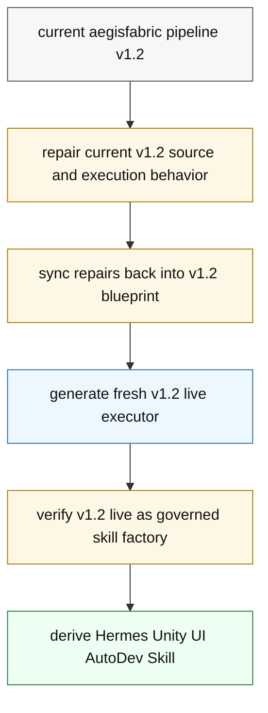
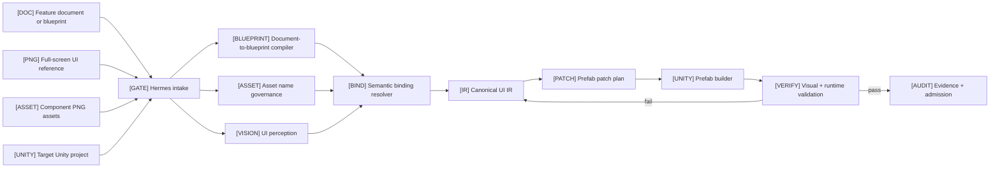
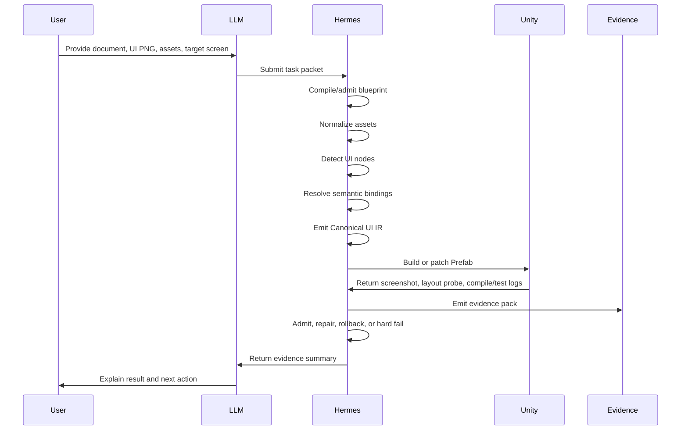
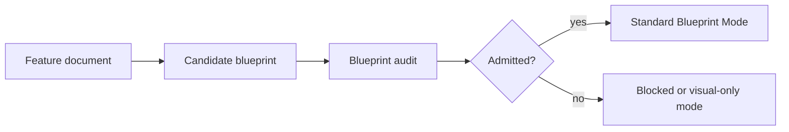
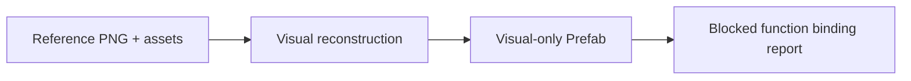

# Hermes Unity UI AutoDev Skill Architecture

`Hermes Unity UI AutoDev Skill` is a governed Unity UI automation child skill. It converts feature intent, full-screen UI references, and prepared component assets into verified Unity Prefabs, feature-binding code, validation evidence, audit trails, and admission verdicts.

Current status: `architecture-design / pre-live-implementation`

This document is the primary project architecture document. It does not claim that `aegisfabric pipeline v1.2` is repaired, stable, or live-ready.

## 1. Purpose

The skill solves the gap between game UI planning, visual design, asset preparation, and Unity implementation.

| Need | Skill Responsibility |
| --- | --- |
| Designers provide a full UI screenshot. | Treat it as visual truth and reconstruct Unity UI from it. |
| UI assets are named loosely. | Normalize assets into a governed asset manifest. |
| Planners provide feature docs, not strict blueprints. | Compile documents into admitted screen blueprints before implementation. |
| LLMs may bypass process by writing files directly. | Keep LLM as task organizer; Hermes owns mutation and admission. |
| Generated UI may look close but still be wrong. | Validate with Unity screenshots, layout probes, tests, and audit evidence. |

## 2. Role Boundary

```text
[LLM]       task driver / intent organizer
[HERMES]    governed executor and admission authority
[UNITY]     mutation target and runtime validation environment
[EVIDENCE]  proof surface for every admitted change
```

The LLM may:

- understand user requests
- summarize feature intent
- prepare candidate task packets
- explain ambiguity and evidence
- dispatch work into Hermes

The LLM must not:

- directly write Unity source files
- directly rename UI assets
- directly edit Prefabs or Scenes
- directly repair generated code
- directly declare admission

Hermes must own:

- file mutation
- asset normalization
- UI reconstruction
- Prefab generation
- code generation
- repair
- validation
- audit
- admission

## 3. v1.2 Derivation Model

This skill is a child skill. It should be derived only after the generic Hermes mother skill is stable.



Important boundary:

```text
v1.2 live = generic governed executor / skill factory
Hermes Unity UI AutoDev Skill = Unity-specific generated child skill
```

The mother skill must not be converted directly into the Unity child skill.

## 4. System Overview



## 5. Capability Matrix

| Icon | Capability | Main Question | Output | Gate |
| --- | --- | --- | --- | --- |
| `[DOC]` | Document-to-Blueprint | What does the screen need to do? | `admitted-screen-blueprint.json` | blueprint admission gate |
| `[ASSET]` | Asset Name Governance | What are these PNG assets? | `asset-manifest.json` | asset manifest gate |
| `[VISION]` | UI Perception | Where are UI elements in the reference PNG? | `perception-report.json` | perception confidence gate |
| `[BIND]` | Semantic Binding | Which component carries which function? | `semantic-binding-report.json` | semantic binding gate |
| `[IR]` | Canonical UI IR | What should Unity build? | `canonical-ui-ir.json` | UI IR schema gate |
| `[PATCH]` | Prefab Patch Planning | What exact Unity mutations are allowed? | `prefab-patch-plan.json` | prefab patch plan gate |
| `[UNITY]` | Unity Prefab Build | Can Unity materialize the UI safely? | Prefab + patch receipt | Unity adapter gate |
| `[VERIFY]` | Visual Verification | Does the generated screen match the reference? | `visual-diff-report.json` | visual diff gate |
| `[CODE]` | Feature AutoDev | Can the UI execute declared behavior? | generated code manifest | compile and interaction gates |
| `[AUDIT]` | Audit And Delta Sync | Is the change explainable and admissible? | `admission-report.md` | admission gate |

## 6. End-To-End Workflow



## 7. Core Workflow Cards

### 7.1 `[DOC]` Document-To-Blueprint

Purpose: convert feature documents into structured screen blueprints before Unity mutation.

```text
feature document
-> extract screens
-> extract functions
-> extract events
-> extract state transitions
-> extract data requirements
-> extract acceptance criteria
-> emit candidate blueprint
-> validate coverage
-> admit or block
```

Inputs:

- feature document
- target screen id
- known game system or module name
- optional UI reference image
- optional component catalog

Outputs:

- `candidate-screen-blueprint.json`
- `functional-graph.json`
- `event-binding-contract.json`
- `state-transition-contract.json`
- `data-binding-contract.json`
- `interaction-test-contract.json`
- `ambiguity-ledger.json`
- `admitted-screen-blueprint.json`

Gate: `blueprint admission gate`

Failure route: if the document lacks functional truth, Hermes emits `blocked_by_blueprint_gap` and permits only visual-only reconstruction.

### 7.2 `[ASSET]` Asset Name Governance

Purpose: normalize loose asset names before reconstruction and binding.

```text
asset folder
-> scan files
-> parse prefixes
-> tokenize names
-> infer category
-> infer component hint
-> infer state hint
-> detect duplicate or weak names
-> emit asset manifest
-> emit rename plan when needed
```

Prefix map:

| Prefix | Component Hint |
| --- | --- |
| `icon_` | Image or icon-button child |
| `button_` | Button |
| `panel_` | Panel or container |
| `bg_` | Background image |
| `tab_` | Tab button |
| `badge_` | Badge or label marker |
| `frame_` | Border or framed panel |
| `input_` | Input field |
| `text_` | Text style or baked text candidate |

Outputs:

- `asset-manifest.json`
- `asset-normalization-ledger.json`
- `asset-ambiguity-ledger.json`
- `asset-rename-plan.json`

Gate: `asset manifest gate`

Failure route: weak names may remain visual assets, but they cannot be auto-bound to functions without stronger blueprint, OCR, or positional evidence.

### 7.3 `[VISION]` UI Perception

Purpose: read the full-screen reference PNG and identify visual UI nodes.

```text
reference PNG
-> detect panels and containers
-> detect buttons and icons
-> OCR text
-> infer grouping
-> infer hierarchy
-> infer layer candidates
-> score component candidates
-> emit perception report
```

Outputs:

- `perception-report.json`
- `visual-node-candidates.json`
- `ocr-report.json`
- `layout-candidate-report.json`
- `layer-candidate-report.json`

Gate: `perception confidence gate`

Failure route: low-confidence nodes go to the ambiguity ledger and may be emitted only as visual placeholders.

### 7.4 `[BIND]` Semantic Binding

Purpose: decide what blueprint function each UI node carries.

```text
blueprint function graph
asset manifest
perception nodes
OCR text
component catalog
-> score evidence
-> bind function
-> admit / block / route ambiguity
```

Scoring signals:

| Signal | Example |
| --- | --- |
| filename prefix | `button_` suggests Button |
| filename tokens | `reward`, `claim`, `shop`, `close` |
| OCR text | `Claim`, `领取`, `Buy` |
| visual role | primary action, icon button, tab |
| position | top-right close, bottom-center confirm |
| nearby context | reward icon near claim button |
| screen scope | current screen is reward screen |
| blueprint graph | expected `reward.claim` action |
| state assets | normal, pressed, disabled, selected |

Confidence tiers:

| Score | Route |
| --- | --- |
| `>= 0.85` | auto admit |
| `0.65 - 0.85` | ambiguity ledger / confirmation needed |
| `< 0.65` | block functional binding |

Outputs:

- `semantic-binding-report.json`
- `function-binding-map.json`
- `ambiguity-ledger.json`

Gate: `semantic binding gate`

Failure route: visual-only generation may continue, but functional code generation is blocked for unbound components.

### 7.5 `[IR]` Canonical UI IR

Purpose: produce the governed intermediate representation consumed by Unity generation.

```text
visual node identity
-> asset truth
-> blueprint function truth
-> RectTransform model
-> hierarchy and sibling order
-> component type
-> state variants
-> event/data bindings
-> audit evidence
-> canonical-ui-ir.json
```

Example:

```json
{
  "ui_node_id": "reward_screen.claim_button",
  "component_type": "Button",
  "asset_ref": "button.reward.claim",
  "rect": {
    "x": 420,
    "y": 860,
    "w": 240,
    "h": 72
  },
  "unity": {
    "component": "UnityEngine.UI.Button",
    "text_component": "TextMeshProUGUI",
    "onClick": "RewardController.OnClaim"
  },
  "audit": {
    "source_image": "reward_screen.png",
    "source_asset": "button_reward_claim.png",
    "blueprint_function": "reward.claim",
    "confidence": 0.91
  }
}
```

Outputs:

- `canonical-ui-ir.json`
- `ui-hierarchy-manifest.json`
- `ui-layout-manifest.json`
- `ui-component-registry.json`

Gate: `UI IR schema gate`

Failure route: identity conflicts, missing function bindings, or invalid layout fields route back to binding or perception repair.

### 7.6 `[PATCH]` Prefab Patch Planning

Purpose: plan Unity Prefab mutations before any write.

```text
Canonical UI IR
current Prefab state
manual override ledger
-> diff desired vs observed
-> classify create/update/delete
-> attach rollback intent
-> detect conflicts
-> emit patch plan
```

Patch categories:

- create Canvas root
- create UI node
- update RectTransform
- assign Sprite
- assign TextMeshPro text
- add or update Button
- add ScrollRect, Mask, Image, LayoutGroup
- bind handler stub
- preserve manual override
- delete obsolete generated node

Outputs:

- `prefab-patch-plan.json`
- `manual-override-conflict-report.json`
- `rollback-plan.json`

Gate: `prefab patch plan gate`

Failure route: manual override conflicts block mutation until resolved or waived.

### 7.7 `[UNITY]` Unity Prefab Build

Purpose: materialize the UI through Unity-owned automation.

```text
prefab patch plan
-> invoke Unity Editor script
-> import or resolve sprites
-> create or patch Canvas root
-> create or patch UI nodes
-> set RectTransform fields
-> assign components and assets
-> bind event stubs
-> save Prefab
-> emit patch receipt
```

Preferred implementation:

- Unity Editor C# scripts read Canonical UI IR
- Editor scripts create or patch Prefabs
- batchmode commands run compile and tests
- probes export hierarchy, components, RectTransforms, and screenshots

Forbidden default:

- uncontrolled direct `.prefab` YAML mutation

Outputs:

- generated or patched `.prefab`
- `prefab-patch-receipt.json`
- `generated-code-manifest.json`

Gate: `Unity adapter gate`

Failure route: Unity editor errors route to governed repair.

### 7.8 `[VERIFY]` Visual Verification

Purpose: confirm the generated Unity UI matches the reference image.

```text
generated Prefab or Scene
-> open in Unity
-> capture screenshot
-> export RectTransform probe
-> compare screenshot to reference PNG
-> detect overlap, offscreen, missing asset, layer mismatch
-> pass or repair
```

Outputs:

- `screenshot-generated.png`
- `rect-transform-probe.json`
- `visual-diff-report.json`

Gate: `visual diff gate`

Failure route: visual failures route to UI IR layout repair, asset mapping repair, or Prefab patch repair.

### 7.9 `[CODE]` Feature AutoDev

Purpose: generate feature binding code after visual and semantic truth are admitted.

```text
admitted blueprint
Canonical UI IR
semantic binding report
-> generate Controller/ViewModel stubs
-> generate event handlers
-> generate state transitions
-> generate data binding placeholders
-> generate interaction tests
-> bind UI events
-> compile and test
```

Outputs:

- generated C# files
- `generated-code-manifest.json`
- interaction tests
- compile/test logs

Gates:

- `Unity compile gate`
- `interaction test gate`

Failure route: compile or test failures route to governed repair; missing blueprint truth blocks functional code admission.

### 7.10 `[AUDIT]` Audit And Delta Sync

Purpose: preserve evidence and protect manual changes.

```text
all run artifacts
prior evidence pack
current Unity state
manual override ledger
-> hash inputs
-> compare prior run
-> detect deltas
-> detect manual overrides
-> attach patch receipts
-> attach validation evidence
-> emit admission report
```

Outputs:

- `input-hashes.json`
- `manual-override-ledger.json`
- `delta-sync-report.json`
- `repair-report.json`
- `admission-report.md`

Gate: `admission gate`

Failure route: dirty manual override conflicts, missing evidence, or failed validation prevents admission.

## 8. Workflow Modes

### 8.1 Standard Blueprint Mode

```mermaid
flowchart LR
    A["Formal blueprint"] --> B["Blueprint validation"]
    B --> C["Asset governance"]
    C --> D["UI perception"]
    D --> E["Semantic binding"]
    E --> F["UI IR"]
    F --> G["Prefab build"]
    G --> H["Visual validation"]
    H --> I["Feature AutoDev"]
    I --> J["Runtime validation"]
    J --> K["Admission"]
```



Use when a formal blueprint already exists.

### 8.2 Feature Document Mode



Use when planning provides only a functional document. The generated blueprint is not authority until it passes admission.

### 8.3 Visual-Only Mode



Allowed:

- visual-only Prefab
- placeholder components
- blocked function binding report

Forbidden:

- completed functional code claim
- event binding admission
- gameplay feature completion claim

### 8.4 Iterative Screen Loop

```text
screen 1 -> reconstruct -> validate -> admit
screen 2 -> reconstruct -> validate -> admit
screen 3 -> reconstruct -> validate -> admit
...
shared components, style tokens, naming improvements, and binding patterns accumulate
```

### 8.5 Modification And Audit Loop

```text
new reference PNG
-> delta detection
-> asset changes
-> blueprint changes
-> prefab patch plan
-> manual override conflict check
-> governed patch
-> visual and runtime revalidation
-> audit report
```

The skill must never silently overwrite manual edits.

## 9. Governance Gates

| Gate | Blocks When |
| --- | --- |
| intake gate | task packet is incomplete |
| blueprint admission gate | function, event, state, or data truth is missing |
| asset manifest gate | assets cannot be categorized or are too ambiguous |
| perception confidence gate | visual detection is below confidence threshold |
| semantic binding gate | UI nodes cannot be mapped to declared functions |
| UI IR schema gate | identity, hierarchy, layout, or binding fields are invalid |
| prefab patch plan gate | mutation lacks rollback or conflicts with manual overrides |
| Unity adapter gate | Unity editor execution fails |
| visual diff gate | generated screenshot diverges beyond threshold |
| Unity compile gate | C# compile fails |
| interaction test gate | declared behavior fails |
| delta sync gate | manual changes are unprotected |
| admission gate | required evidence is missing or failed |

## 10. Repair Routing

| Failure | Repair Route |
| --- | --- |
| missing blueprint function | Document-to-Blueprint |
| weak asset naming | Asset Name Governance |
| bad node detection | UI Perception |
| wrong function binding | Semantic Binding |
| bad layout | Canonical UI IR |
| unsafe Prefab mutation | Prefab Patch Planning |
| Unity editor error | Unity Prefab Build |
| visual mismatch | Visual Verification |
| compile failure | Feature AutoDev |
| manual override conflict | Audit And Delta Sync |

## 11. Evidence Pack

```text
.hermes/evidence/<screen_id>/<run_id>/
|- task-packet.json
|- input-hashes.json
|- document-blueprint-compile-report.json
|- admitted-screen-blueprint.json
|- asset-manifest.json
|- asset-normalization-ledger.json
|- perception-report.json
|- semantic-binding-report.json
|- ambiguity-ledger.json
|- canonical-ui-ir.json
|- prefab-patch-plan.json
|- prefab-patch-receipt.json
|- rect-transform-probe.json
|- screenshot-reference.png
|- screenshot-generated.png
|- visual-diff-report.json
|- generated-code-manifest.json
|- unity-compile.log
|- editmode-tests.log
|- playmode-tests.log
|- console-error-scan.json
|- manual-override-ledger.json
|- repair-report.json
`- admission-report.md
```

## 12. Key Data Contracts

### 12.1 Task Packet

```json
{
  "task_type": "build_unity_ui_screen",
  "screen_id": "reward_screen",
  "reference_image": "Assets/UIReferences/reward_screen.png",
  "asset_folder": "Assets/UIRaw/reward",
  "feature_document": "Docs/reward_feature.md",
  "unity_project_root": "/path/to/unity/project",
  "requested_outputs": [
    "admitted_blueprint",
    "prefab",
    "feature_binding_code",
    "visual_validation",
    "runtime_validation",
    "audit_report"
  ]
}
```

### 12.2 Admission Report

```json
{
  "screen_id": "reward_screen",
  "run_id": "2026-05-26T09-00-00Z",
  "visual_state": "pass",
  "function_binding_state": "pass",
  "unity_compile_state": "pass",
  "interaction_test_state": "pass",
  "manual_override_state": "clean",
  "admission": "pass",
  "closure_claim": "screen_implementation_admitted",
  "production_release_claim": "forbidden"
}
```

## 13. Authority Model

| Truth Layer | Authority | Notes |
| --- | --- | --- |
| Full UI reference PNG | Visual truth | Used as screenshot comparison baseline. |
| Component asset library | Asset truth | Normalized into the asset manifest before use. |
| Admitted blueprint | Functional and semantic truth | Generated from docs only after governance admission. |
| Canonical UI IR | Execution truth for Unity projection | Unity builder consumes this, not raw PNGs. |
| Unity Prefab and C# | Governed projection | Valid only after validation and admission. |

## 14. Roadmap

| Phase | Goal | Exit Criteria |
| --- | --- | --- |
| Phase 0 | Architecture documents | README and architecture published. |
| Phase 1 | v1.2 mother skill readiness | current v1.2 repaired, blueprint-synced, and fresh v1.2 live generated. |
| Phase 2 | Child skill skeleton | `SKILL.md`, schemas, task packet, evidence pack, UI IR, patch plan. |
| Phase 3 | Planning and asset front end | document-to-blueprint, asset governance, perception, semantic binding. |
| Phase 4 | Unity materialization | Editor script bridge, Prefab builder, screenshot/probe capture. |
| Phase 5 | Closed-loop validation | visual diff, compile/tests, audit, repair, admission. |

## 15. Success Criteria

The first useful target is one complete screen:

```text
feature document + full-screen reference PNG + component assets
-> admitted blueprint
-> normalized asset manifest
-> generated Unity Prefab
-> generated feature-binding code
-> visual diff pass
-> Unity compile/test pass
-> audit/admission report
```

The skill becomes production-worthy only after repeated screen loops prove:

- stable component reuse
- robust naming normalization
- predictable semantic binding
- safe manual override preservation
- reliable visual diff repair
- repeatable Unity validation
- no uncontrolled LLM file mutation

## 16. Final Statement

`Hermes Unity UI AutoDev Skill` combines UI reconstruction and automatic feature development into one governed workflow.

Its promise is:

```text
from feature intent and prepared UI visuals
to verified Unity Prefab and functional code
through governed execution, validation, audit, and repair
```

The skill is valid only when Hermes remains the execution authority and the LLM remains the task organizer.
