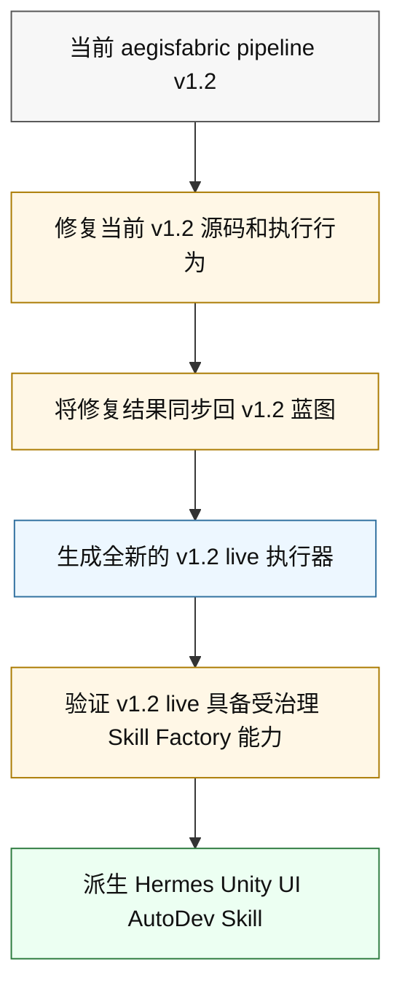
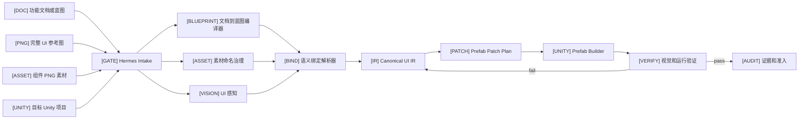
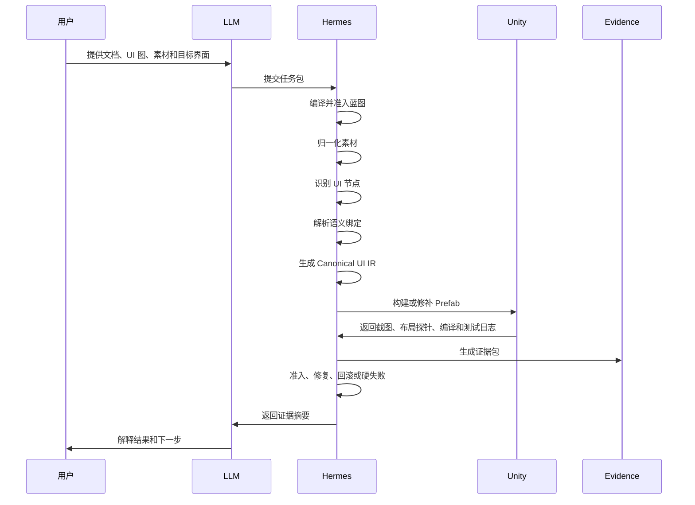
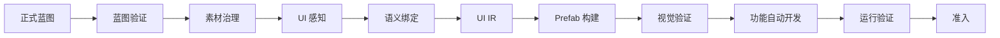
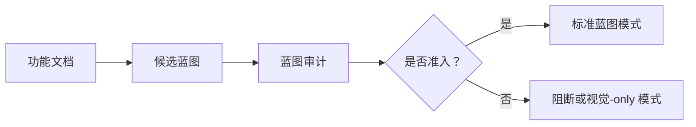
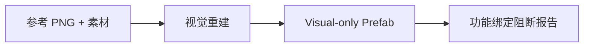

# Hermes Unity UI AutoDev Skill 架构

`Hermes Unity UI AutoDev Skill` 是一个受治理的 Unity UI 自动开发子 Skill。它把功能意图、完整 UI 参考图、已准备好的组件素材，转换成经过验证的 Unity Prefab、功能绑定代码、验证证据、审计记录和准入结论。

当前状态：`architecture-design / pre-live-implementation`

本文档是项目的中文架构说明。它不声明 `aegisfabric pipeline v1.2` 已经完成修复、稳定或具备 live-ready 状态。

## 1. 目标

这个 Skill 解决游戏 UI 从策划、视觉、素材到 Unity 落地之间的断层。

| 需求 | Skill 职责 |
| --- | --- |
| 设计提供完整 UI 截图。 | 将截图作为视觉真相，并据此重建 Unity UI。 |
| UI 素材命名不够标准。 | 将素材整理成受治理的资产清单。 |
| 策划只提供功能文档，不提供标准蓝图。 | 先把文档编译成可准入的界面蓝图，再进入实现。 |
| LLM 直接写文件会绕过流程。 | LLM 只做任务整理，Hermes 才拥有写入和准入权限。 |
| 生成的 Prefab 看起来接近但可能不正确。 | 用 Unity 截图、布局探针、测试和审计证据验证。 |

## 2. 角色边界

```text
[LLM]       任务推动者 / 意图整理者
[HERMES]    受治理执行者 / 准入裁决者
[UNITY]     变更目标 / 运行验证环境
[EVIDENCE]  每个已准入变更的证据面
```

LLM 可以：

- 理解用户需求
- 整理功能意图
- 准备候选任务包
- 解释歧义和证据
- 将任务派发给 Hermes

LLM 不可以：

- 直接写 Unity 源码
- 直接重命名 UI 素材
- 直接编辑 Prefab 或 Scene
- 直接修复生成代码
- 直接声明准入完成

Hermes 必须拥有：

- 文件写入
- 素材归一化
- UI 重建
- Prefab 生成
- 代码生成
- 修复
- 验证
- 审计
- 准入

## 3. v1.2 派生模型

这个 Skill 是子 Skill。它应该在通用 Hermes 母 Skill 稳定之后再派生。



关键边界：

```text
v1.2 live = 通用受治理执行器 / Skill Factory
Hermes Unity UI AutoDev Skill = Unity 领域专用子 Skill
```

母 Skill 不能直接被改造成 Unity 子 Skill。母 Skill 应保持通用治理和生成能力，Unity UI AutoDev 应作为领域子 Skill 派生出来。

## 4. 系统总览



## 5. 能力矩阵

| 标识 | 能力 | 关键问题 | 输出 | 治理门 |
| --- | --- | --- | --- | --- |
| `[DOC]` | Document-to-Blueprint | 这个界面需要完成什么功能？ | `admitted-screen-blueprint.json` | blueprint admission gate |
| `[ASSET]` | Asset Name Governance | 这些 PNG 素材分别是什么？ | `asset-manifest.json` | asset manifest gate |
| `[VISION]` | UI Perception | 参考图里的 UI 元素在哪里？ | `perception-report.json` | perception confidence gate |
| `[BIND]` | Semantic Binding | 哪个组件承载哪个功能？ | `semantic-binding-report.json` | semantic binding gate |
| `[IR]` | Canonical UI IR | Unity 应该构建什么？ | `canonical-ui-ir.json` | UI IR schema gate |
| `[PATCH]` | Prefab Patch Planning | 哪些 Unity 变更被允许？ | `prefab-patch-plan.json` | prefab patch plan gate |
| `[UNITY]` | Unity Prefab Build | Unity 能否安全地物化 UI？ | Prefab + patch receipt | Unity adapter gate |
| `[VERIFY]` | Visual Verification | 生成界面是否匹配参考图？ | `visual-diff-report.json` | visual diff gate |
| `[CODE]` | Feature AutoDev | UI 是否能执行声明的功能？ | generated code manifest | compile and interaction gates |
| `[AUDIT]` | Audit And Delta Sync | 变更是否可解释、可审计、可准入？ | `admission-report.md` | admission gate |

## 6. 端到端工作流



## 7. 核心功能流程卡

### 7.1 `[DOC]` Document-To-Blueprint

目标：在任何 Unity 变更之前，把功能文档转换为结构化界面蓝图。

```text
功能文档
-> 提取界面
-> 提取功能
-> 提取事件
-> 提取状态转换
-> 提取数据需求
-> 提取验收条件
-> 生成候选蓝图
-> 验证覆盖度
-> 准入或阻断
```

输入：

- 功能文档
- 目标界面 id
- 已知游戏系统或模块名
- 可选 UI 参考图
- 可选组件目录

输出：

- `candidate-screen-blueprint.json`
- `functional-graph.json`
- `event-binding-contract.json`
- `state-transition-contract.json`
- `data-binding-contract.json`
- `interaction-test-contract.json`
- `ambiguity-ledger.json`
- `admitted-screen-blueprint.json`

治理门：`blueprint admission gate`

失败路由：如果文档缺少功能真相，Hermes 输出 `blocked_by_blueprint_gap`，只允许视觉级 UI 重建。

### 7.2 `[ASSET]` Asset Name Governance

目标：在 UI 重建和功能绑定之前，整理不规范的素材命名。

```text
素材目录
-> 扫描文件
-> 解析前缀
-> 拆分命名 token
-> 推断分类
-> 推断组件类型
-> 推断状态
-> 检测重复或弱命名
-> 生成资产清单
-> 必要时生成重命名计划
```

前缀映射：

| 前缀 | 组件提示 |
| --- | --- |
| `icon_` | Image 或 icon-button 子节点 |
| `button_` | Button |
| `panel_` | Panel 或 Container |
| `bg_` | Background Image |
| `tab_` | Tab Button |
| `badge_` | Badge 或 Label Marker |
| `frame_` | Border 或 Framed Panel |
| `input_` | Input Field |
| `text_` | Text Style 或 baked text candidate |

输出：

- `asset-manifest.json`
- `asset-normalization-ledger.json`
- `asset-ambiguity-ledger.json`
- `asset-rename-plan.json`

治理门：`asset manifest gate`

失败路由：弱命名素材可以作为视觉素材继续使用，但不能在缺少蓝图、OCR 或位置证据时自动绑定到功能。

### 7.3 `[VISION]` UI Perception

目标：读取完整 UI 参考图，识别视觉 UI 节点。

```text
参考 PNG
-> 检测面板和容器
-> 检测按钮和图标
-> OCR 文本
-> 推断分组
-> 推断层级
-> 推断层级候选
-> 评分组件候选
-> 生成感知报告
```

输出：

- `perception-report.json`
- `visual-node-candidates.json`
- `ocr-report.json`
- `layout-candidate-report.json`
- `layer-candidate-report.json`

治理门：`perception confidence gate`

失败路由：低置信度节点进入歧义账本，只能作为视觉占位，不能直接准入为功能节点。

### 7.4 `[BIND]` Semantic Binding

目标：判断每个 UI 节点承载哪个蓝图功能。

```text
蓝图功能图
资产清单
感知节点
OCR 文本
组件目录
-> 证据评分
-> 绑定功能
-> 准入 / 阻断 / 进入歧义账本
```

评分信号：

| 信号 | 示例 |
| --- | --- |
| 文件名前缀 | `button_` 提示 Button |
| 文件名 token | `reward`, `claim`, `shop`, `close` |
| OCR 文案 | `Claim`, `领取`, `Buy` |
| 视觉角色 | primary action, icon button, tab |
| 位置 | 右上角关闭按钮，底部确认按钮 |
| 邻近上下文 | claim 按钮附近有 reward icon |
| 界面范围 | 当前界面是 reward screen |
| 蓝图功能图 | 预期存在 `reward.claim` action |
| 状态素材 | normal, pressed, disabled, selected |

置信度分层：

| 分数 | 路由 |
| --- | --- |
| `>= 0.85` | 自动准入 |
| `0.65 - 0.85` | 进入歧义账本 / 需要确认 |
| `< 0.65` | 阻断功能绑定 |

输出：

- `semantic-binding-report.json`
- `function-binding-map.json`
- `ambiguity-ledger.json`

治理门：`semantic binding gate`

失败路由：视觉级生成可以继续，但未绑定功能的组件不能生成对应功能代码。

### 7.5 `[IR]` Canonical UI IR

目标：生成 Unity 构建器消费的受治理中间表示。

```text
视觉节点身份
-> 资产真相
-> 蓝图功能真相
-> RectTransform 模型
-> 层级和 sibling order
-> 组件类型
-> 状态变体
-> 事件和数据绑定
-> 审计证据
-> canonical-ui-ir.json
```

示例：

```json
{
  "ui_node_id": "reward_screen.claim_button",
  "component_type": "Button",
  "asset_ref": "button.reward.claim",
  "rect": {
    "x": 420,
    "y": 860,
    "w": 240,
    "h": 72
  },
  "unity": {
    "component": "UnityEngine.UI.Button",
    "text_component": "TextMeshProUGUI",
    "onClick": "RewardController.OnClaim"
  },
  "audit": {
    "source_image": "reward_screen.png",
    "source_asset": "button_reward_claim.png",
    "blueprint_function": "reward.claim",
    "confidence": 0.91
  }
}
```

输出：

- `canonical-ui-ir.json`
- `ui-hierarchy-manifest.json`
- `ui-layout-manifest.json`
- `ui-component-registry.json`

治理门：`UI IR schema gate`

失败路由：身份冲突、缺失功能绑定或布局字段非法时，返回语义绑定或 UI 感知修复。

### 7.6 `[PATCH]` Prefab Patch Planning

目标：在任何写入之前规划 Unity Prefab 变更。

```text
Canonical UI IR
当前 Prefab 状态
人工覆盖账本
-> 对比期望状态和实际状态
-> 分类 create/update/delete
-> 附加回滚意图
-> 检测冲突
-> 生成 patch plan
```

Patch 类型：

- 创建 Canvas 根节点
- 创建 UI 节点
- 更新 RectTransform
- 分配 Sprite
- 分配 TextMeshPro 文本
- 添加或更新 Button
- 添加 ScrollRect、Mask、Image、LayoutGroup
- 绑定 handler stub
- 保留人工覆盖
- 删除过期生成节点

输出：

- `prefab-patch-plan.json`
- `manual-override-conflict-report.json`
- `rollback-plan.json`

治理门：`prefab patch plan gate`

失败路由：人工覆盖冲突会阻断写入，直到解决或被显式 waiver。

### 7.7 `[UNITY]` Unity Prefab Build

目标：通过 Unity 自有自动化机制物化 UI。

```text
prefab patch plan
-> 调用 Unity Editor Script
-> 导入或解析 Sprite
-> 创建或修补 Canvas 根节点
-> 创建或修补 UI 节点
-> 设置 RectTransform 字段
-> 分配组件和资源
-> 绑定事件 stub
-> 保存 Prefab
-> 生成 patch receipt
```

推荐实现：

- Unity Editor C# 脚本读取 Canonical UI IR
- Editor 脚本创建或修补 Prefab
- batchmode 命令运行编译和测试
- probe 导出层级、组件、RectTransform 和截图

默认禁止：

- 不受治理地直接编辑 `.prefab` YAML

输出：

- 生成或修补后的 `.prefab`
- `prefab-patch-receipt.json`
- `generated-code-manifest.json`

治理门：`Unity adapter gate`

失败路由：Unity Editor 错误进入受治理修复流程。

### 7.8 `[VERIFY]` Visual Verification

目标：确认生成的 Unity UI 与参考图匹配。

```text
生成的 Prefab 或 Scene
-> 在 Unity 中打开
-> 截图
-> 导出 RectTransform probe
-> 将截图与参考 PNG 对比
-> 检测重叠、越界、素材缺失、层级错误
-> 通过或修复
```

输出：

- `screenshot-generated.png`
- `rect-transform-probe.json`
- `visual-diff-report.json`

治理门：`visual diff gate`

失败路由：视觉失败路由到 UI IR 布局修复、资产映射修复或 Prefab Patch 修复。

### 7.9 `[CODE]` Feature AutoDev

目标：在视觉和语义真相准入后生成功能绑定代码。

```text
已准入蓝图
Canonical UI IR
语义绑定报告
-> 生成 Controller/ViewModel stub
-> 生成事件 handler
-> 生成状态转换
-> 生成数据绑定占位
-> 生成交互测试
-> 绑定 UI 事件
-> 编译和测试
```

输出：

- 生成的 C# 文件
- `generated-code-manifest.json`
- 交互测试
- 编译和测试日志

治理门：

- `Unity compile gate`
- `interaction test gate`

失败路由：编译或测试失败进入受治理修复；缺少蓝图真相时阻断功能代码准入。

### 7.10 `[AUDIT]` Audit And Delta Sync

目标：保存证据并保护人工修改。

```text
全部运行产物
上一轮证据包
当前 Unity 状态
人工覆盖账本
-> 哈希输入
-> 对比上一轮
-> 检测增量
-> 检测人工覆盖
-> 关联 patch receipt
-> 关联验证证据
-> 生成 admission report
```

输出：

- `input-hashes.json`
- `manual-override-ledger.json`
- `delta-sync-report.json`
- `repair-report.json`
- `admission-report.md`

治理门：`admission gate`

失败路由：未解决的人工覆盖冲突、缺失证据或验证失败都会阻断准入。

## 8. 工作模式

### 8.1 标准蓝图模式



适用于已经存在正式蓝图的情况。

### 8.2 功能文档模式



适用于策划只提供功能文档的情况。生成蓝图必须通过准入后才成为权威。

### 8.3 Visual-Only 模式



允许：

- visual-only Prefab
- 占位组件
- 功能绑定阻断报告

禁止：

- 声明功能代码完成
- 事件绑定准入
- 游戏功能完成声明

### 8.4 逐界面循环

```text
界面 1 -> 重建 -> 验证 -> 准入
界面 2 -> 重建 -> 验证 -> 准入
界面 3 -> 重建 -> 验证 -> 准入
...
共享组件、样式 token、命名改进和绑定模式持续沉淀
```

### 8.5 修改和审计循环

```text
新的参考 PNG
-> delta detection
-> 素材变化
-> 蓝图变化
-> prefab patch plan
-> 人工覆盖冲突检查
-> 受治理 patch
-> 视觉和运行重新验证
-> 审计报告
```

Skill 必须禁止静默覆盖人工修改。

## 9. 治理门

| 治理门 | 阻断条件 |
| --- | --- |
| intake gate | 任务包不完整 |
| blueprint admission gate | 缺少功能、事件、状态或数据真相 |
| asset manifest gate | 素材无法分类或歧义过高 |
| perception confidence gate | 视觉识别低于置信度阈值 |
| semantic binding gate | UI 节点无法映射到声明功能 |
| UI IR schema gate | 身份、层级、布局或绑定字段非法 |
| prefab patch plan gate | 变更缺少回滚或与人工覆盖冲突 |
| Unity adapter gate | Unity Editor 执行失败 |
| visual diff gate | 生成截图与参考图差异超过阈值 |
| Unity compile gate | C# 编译失败 |
| interaction test gate | 声明的交互行为失败 |
| delta sync gate | 人工修改未受保护 |
| admission gate | 必需证据缺失或验证失败 |

## 10. 修复路由

| 失败类型 | 修复路由 |
| --- | --- |
| 缺少蓝图功能 | Document-to-Blueprint |
| 素材命名弱 | Asset Name Governance |
| 节点识别错误 | UI Perception |
| 功能绑定错误 | Semantic Binding |
| 布局错误 | Canonical UI IR |
| Prefab 变更不安全 | Prefab Patch Planning |
| Unity Editor 错误 | Unity Prefab Build |
| 视觉不匹配 | Visual Verification |
| 编译失败 | Feature AutoDev |
| 人工覆盖冲突 | Audit And Delta Sync |

## 11. 证据包

```text
.hermes/evidence/<screen_id>/<run_id>/
|- task-packet.json
|- input-hashes.json
|- document-blueprint-compile-report.json
|- admitted-screen-blueprint.json
|- asset-manifest.json
|- asset-normalization-ledger.json
|- perception-report.json
|- semantic-binding-report.json
|- ambiguity-ledger.json
|- canonical-ui-ir.json
|- prefab-patch-plan.json
|- prefab-patch-receipt.json
|- rect-transform-probe.json
|- screenshot-reference.png
|- screenshot-generated.png
|- visual-diff-report.json
|- generated-code-manifest.json
|- unity-compile.log
|- editmode-tests.log
|- playmode-tests.log
|- console-error-scan.json
|- manual-override-ledger.json
|- repair-report.json
`- admission-report.md
```

## 12. 核心数据契约

### 12.1 Task Packet

```json
{
  "task_type": "build_unity_ui_screen",
  "screen_id": "reward_screen",
  "reference_image": "Assets/UIReferences/reward_screen.png",
  "asset_folder": "Assets/UIRaw/reward",
  "feature_document": "Docs/reward_feature.md",
  "unity_project_root": "/path/to/unity/project",
  "requested_outputs": [
    "admitted_blueprint",
    "prefab",
    "feature_binding_code",
    "visual_validation",
    "runtime_validation",
    "audit_report"
  ]
}
```

### 12.2 Admission Report

```json
{
  "screen_id": "reward_screen",
  "run_id": "2026-05-26T09-00-00Z",
  "visual_state": "pass",
  "function_binding_state": "pass",
  "unity_compile_state": "pass",
  "interaction_test_state": "pass",
  "manual_override_state": "clean",
  "admission": "pass",
  "closure_claim": "screen_implementation_admitted",
  "production_release_claim": "forbidden"
}
```

## 13. 权威模型

| 真相层 | 权威 | 说明 |
| --- | --- | --- |
| 完整 UI 参考图 | 视觉真相 | 作为截图对比基准。 |
| 组件素材库 | 资产真相 | 使用前必须归一化为 asset manifest。 |
| 已准入蓝图 | 功能和语义真相 | 从文档生成的蓝图必须先通过治理准入。 |
| Canonical UI IR | Unity 投影执行真相 | Unity Builder 消费它，而不是直接消费原图。 |
| Unity Prefab 和 C# | 受治理投影 | 只有通过验证和准入后才有效。 |

## 14. 路线图

| 阶段 | 目标 | 退出条件 |
| --- | --- | --- |
| Phase 0 | 架构文档 | README 和架构文档发布。 |
| Phase 1 | v1.2 母 Skill 准备 | 当前 v1.2 修复、蓝图同步、生成全新 v1.2 live。 |
| Phase 2 | 子 Skill 骨架 | `SKILL.md`、schemas、task packet、evidence pack、UI IR、patch plan。 |
| Phase 3 | 策划和素材前端 | document-to-blueprint、asset governance、perception、semantic binding。 |
| Phase 4 | Unity 物化 | Editor script bridge、Prefab builder、screenshot/probe capture。 |
| Phase 5 | 闭环验证 | visual diff、compile/tests、audit、repair、admission。 |

## 15. 成功标准

第一个有效目标是完成一个完整界面：

```text
功能文档 + 完整 UI 参考图 + 组件素材
-> 已准入蓝图
-> 已归一化资产清单
-> 已生成 Unity Prefab
-> 已生成功能绑定代码
-> visual diff 通过
-> Unity compile/test 通过
-> audit/admission report
```

达到生产级还需要跨多个界面证明：

- 组件复用稳定
- 命名归一化可靠
- 语义绑定可预测
- 人工覆盖保护安全
- 视觉差异修复可靠
- Unity 验证可重复
- 没有不受治理的 LLM 文件写入

## 16. 最终定义

`Hermes Unity UI AutoDev Skill` 将 UI 重建和功能自动开发合并为一个受治理工作流。

它的承诺是：

```text
从功能意图和已准备好的 UI 视觉资产
到经过验证的 Unity Prefab 和功能代码
通过受治理执行、验证、审计和修复完成闭环
```

只有当 Hermes 始终是执行权威、LLM 始终只是任务整理者时，这个 Skill 才成立。
