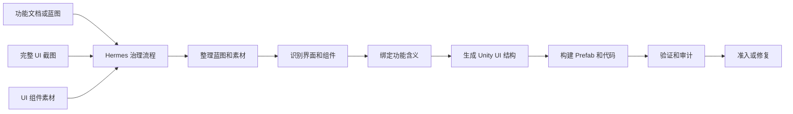

# Hermes Unity UI AutoDev Skill 大白话版

当前状态：`architecture-design / pre-live-implementation`

这份文档是给第一次看这个项目的人看的。它不讲太多内部技术名词，主要说明这个 Skill 到底想解决什么问题、怎么工作、为什么需要治理，以及什么时候才能说一个界面真的做完了。

## 一句话总结

`Hermes Unity UI AutoDev Skill` 想做的是：

```text
把策划文档、完整 UI 截图、UI 组件素材
变成 Unity 里可验证的 Prefab、功能代码、测试证据和审计报告。
```

它不是简单地把一张图贴进 Unity，也不是让 LLM 自由写代码。它的核心目标是做一个受治理的 Unity UI 自动开发流程。

## 它解决什么问题

游戏 UI 开发经常卡在这些地方：

| 现实问题 | 这个 Skill 的处理方式 |
| --- | --- |
| 策划只给了功能文档，没有标准蓝图。 | 先把功能文档整理成可检查的界面蓝图。 |
| 美术给了完整界面图，但 Unity 还没有对应界面。 | 识别完整界面图，把它还原成 Unity UI 结构。 |
| UI 组件素材很多，命名不一定标准。 | 先整理素材命名和用途，生成资产清单。 |
| 不知道某个按钮到底对应什么功能。 | 结合蓝图、截图文字、位置、素材名字一起判断功能绑定。 |
| LLM 直接改文件容易绕过流程。 | LLM 只整理任务，真正写文件必须由 Hermes Skill 执行。 |
| 生成出来看着像，但不知道是否正确。 | 用截图对比、Unity 编译、交互测试、审计报告来验收。 |

## 需要准备什么

最理想的输入是：

```text
1. 功能文档或正式蓝图
2. 一张完整的目标 UI 截图
3. 已导出的 UI 组件 PNG 素材
4. 一个 Unity 项目
5. 当前要做的界面名称或界面 id
```

如果没有正式蓝图，也可以先用功能文档启动。但这种情况下，Skill 必须先生成并准入蓝图，不能直接进入功能代码开发。

## 最重要的角色分工

这个项目最核心的规则是：

```text
LLM 负责理解、整理、解释和推动任务。
Hermes Unity UI AutoDev Skill 负责真正落地、修改、修复、验证和准入。
```

也就是说：

- LLM 可以理解你想做什么。
- LLM 可以把你的文档、截图、素材整理成任务包。
- LLM 可以解释哪里有歧义。
- 但 LLM 不应该直接改 Unity 文件、直接写 C#、直接重命名素材、直接生成 Prefab。
- 真正执行这些动作的必须是 Hermes Skill。

这样做的原因很简单：如果 LLM 可以随便直接改文件，那治理流程就会失效。Hermes 必须是最终执行者，治理内核才有意义。

## 它怎么一步一步工作

大流程可以理解成这样：

```text
用户给资料
-> LLM 整理任务
-> Hermes 接收任务包
-> Hermes 把功能文档变成蓝图
-> Hermes 整理 UI 素材
-> Hermes 识别完整 UI 截图
-> Hermes 判断每个 UI 组件承载什么功能
-> Hermes 生成 Unity 可消费的 UI 中间结构
-> Hermes 生成 Prefab 修改计划
-> Hermes 调用 Unity 构建或修补 Prefab
-> Hermes 生成或绑定功能代码
-> Hermes 跑 Unity 编译、截图对比、交互测试
-> Hermes 生成证据包和审计报告
-> 通过才准入，失败就进入修复流程
```

简单流程图：



## UI 拼接是怎么理解的

这里的 UI 拼接不是把 PSD 或 PNG 直接转成 Unity Prefab。

更准确的说法是：

```text
完整 UI 截图 = 视觉参考
组件 PNG 素材 = 可使用的 UI 零件
功能文档或蓝图 = 这个界面要做什么
Hermes = 负责把这些信息变成 Unity Prefab 和功能代码的执行者
```

比如一个奖励界面：

- 完整截图告诉 Skill：按钮在哪、标题在哪、奖励图标在哪、整体布局长什么样。
- 组件素材告诉 Skill：可以用哪些 button、icon、panel、bg。
- 功能文档告诉 Skill：领取按钮应该触发领取奖励，关闭按钮应该返回上一层。
- Hermes 把这些信息整理成 Unity UI 结构，再创建或修补 Prefab。

## 素材命名不规范怎么办

这个 Skill 不要求素材一开始就完美命名，但至少希望有一些前缀线索，例如：

```text
button_xxx_xxx
icon_xxx_xxx
panel_xxx_xxx
bg_xxx_xxx
tab_xxx_xxx
```

Hermes 会先做素材治理：

```text
扫描素材
-> 识别前缀
-> 拆分名字里的关键词
-> 判断它可能是什么组件
-> 判断它可能对应什么状态
-> 发现重复、弱命名和歧义
-> 生成资产清单
-> 必要时生成重命名计划
```

如果一个素材名字太弱，Hermes 不能强行把它绑定成某个功能。它可以先作为视觉素材使用，但功能绑定必须有更多证据。

## 它怎么知道按钮对应什么功能

Hermes 不应该只靠文件名猜。

它会综合多个证据：

| 证据 | 例子 |
| --- | --- |
| 文件名前缀 | `button_` 大概率是按钮。 |
| 文件名关键词 | `claim`、`reward`、`shop`、`close`。 |
| 截图里的文字 | 按钮上写着 `领取`、`购买`、`关闭`。 |
| 组件位置 | 右上角通常可能是关闭按钮。 |
| 周围上下文 | 按钮旁边有奖励图标，可能是领取奖励。 |
| 当前界面目标 | 当前界面是奖励界面、商店界面、背包界面。 |
| 蓝图功能 | 蓝图里声明了 `reward.claim` 这个动作。 |

只有证据足够强，才自动绑定。证据不够就进入歧义账本，让用户确认或等待更多信息。

## 为什么必须有蓝图

因为 UI 不只是长得像，还要知道它在游戏里做什么。

如果只有截图和素材，Hermes 最多能做出一个 visual-only 的界面，也就是看起来像的 Prefab。但它不能声明功能完成。

要生成功能代码，必须先知道：

- 这个界面有哪些功能
- 每个按钮触发什么事件
- 有哪些状态切换
- 需要读取或显示哪些数据
- 用户点击后应该发生什么

这些内容必须来自正式蓝图，或者由功能文档生成并通过准入的蓝图。

## 修改和审计怎么处理

这个 Skill 不是只跑一次。真实开发里界面会不断改。

所以它需要支持循环：

```text
第一次生成界面
-> 用户或开发者修改
-> 新截图或新文档进入
-> Hermes 对比差异
-> 判断哪些地方该改
-> 检查是否会覆盖人工修改
-> 生成 patch plan
-> 执行修补
-> 再验证
-> 再生成审计报告
```

关键原则是：不能静默覆盖人工修改。

如果 Hermes 发现某个地方已经被人手动改过，它必须记录冲突，等待明确处理，而不是直接覆盖。

## 什么算真正完成

一个界面不能因为“生成了 Prefab”就算完成。

至少要满足：

```text
蓝图已准入
素材清单已准入
UI 结构已生成
Prefab 已生成或修补
功能代码已生成或绑定
Unity 编译通过
交互测试通过
生成截图和参考图对比通过
没有未处理的人工覆盖冲突
证据包完整
审计报告通过
```

只有这些都通过，才能说这个界面进入准入状态。

## 它不是做什么的

这个 Skill 不是：

- 不是 PSD 一键转 Unity 的工具。
- 不是只靠图片识别来生成 UI 的工具。
- 不是让 LLM 自由写 Unity 代码的工具。
- 不是跳过 Unity 编译和测试的工具。
- 不是没有证据也能说完成的自动化脚本。

它更像一个受治理的 Unity UI 开发流水线：每一步都要有输入、输出、证据、失败路由和准入条件。

## 和 v1.2 的关系

这个 Skill 不应该直接从当前不稳定的 v1.2 手工改出来。

更合理的顺序是：

```text
修复当前 aegisfabric pipeline v1.2
-> 把修复后的行为同步回 v1.2 蓝图
-> 用修复后的蓝图生成全新的 v1.2 live
-> 验证 v1.2 live 具备稳定的 Skill Factory 能力
-> 再派生 Hermes Unity UI AutoDev Skill
```

也就是说，v1.2 应该是通用母 Skill，负责治理和生成能力。`Hermes Unity UI AutoDev Skill` 是 Unity UI 领域的子 Skill。

## 最终闭环

最终想达到的闭环是：

```text
策划给功能文档
美术给完整界面图和组件素材
LLM 整理任务意图
Hermes 生成蓝图、拼接 UI、生成代码、修复问题
Unity 负责真实编译和运行验证
Hermes 收集证据并决定准入
用户继续下一个界面
```

一个界面完成后，进入下一个界面。每轮都会沉淀素材命名、组件复用、功能绑定、修复记录和审计证据。这样循环往复，才是完整的 UI 拼接和自动开发闭环。
